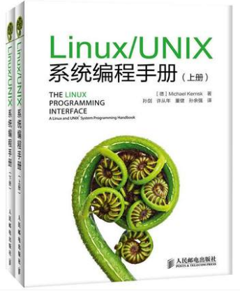

# Linux/UNIX 环境高级编程学习笔记

本仓库已经开始作为GitBook仓库，访问地址

<https://yifengyou.gitbooks.io/learn-tlpi/content/>

GitHub访问地址

<https://github.com/yifengyou/learn-tlpi>

```
Something I hope you know before go into the coding~
First, please watch or star this repo, I'll be more happy if you follow me.
Bug report, questions and discussion are welcome, you can post an issue or pull a request.
```


## 参考书目

> 《linux/unix系统编程手册(上、下册)》



《linux/unix系统编程手册(上、下册)》是介绍linux与unix编程接口的权威著作。linux编程资深专家michael kerrisk在书中详细描述了linux/unix系统编程所涉及的系统调用和库函数，并辅之以全面而清晰的代码示例。《linux/unix系统编程手册(上、下册)》涵盖了逾500个系统调用及库函数，并给出逾200个程序示例，另含88张表格和115幅示意图。

《linux/unix系统编程手册(上、下册)》总共分为64章，主要讲解了高效读写文件，对信号、时钟和定时器的运用，创建进程、执行程序，编写安全的应用程序，运用posix线程技术编写多线程程序，创建和使用共享库，运用管道、消息队列、共享内存和信号量技术来进行进程间通信，以及运用套接字api编写网络应用等内容。

《linux/unix系统编程手册(上、下册)》在汇聚大批 linux专有特性(epoll、inotify、/proc)的同时，还特意强化了对unix标准(posix、sus)的论述，彻底达到了“鱼与熊掌，二者得兼”的效果，这也堪称本书的最大亮点。

《linux/unix系统编程手册(上、下册)》布局合理，论述清晰，说理透彻，尤其是作者对示例代码的构思巧妙，独具匠心，仔细研读定会受益良多。本书适合从事linux/unix系统开发、运维工作的技术人员阅读，同时也可作为高校计算机专业学生的参考研习资料。


## 注意事项

1. 源码不要再Windows端解压，会破坏软链接造成编译失败等问题。
2. 论实践的重要性

## 参考博客

## 思维导图


## 总结

```
1. 概念的东西理解记忆
2. 基础永远值得花费90%的精力去学习加强。厚积而薄发~
```
